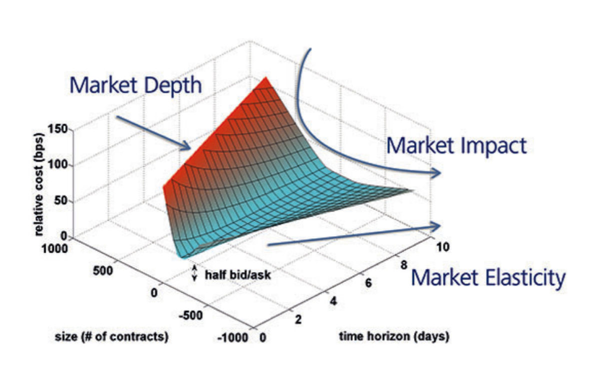
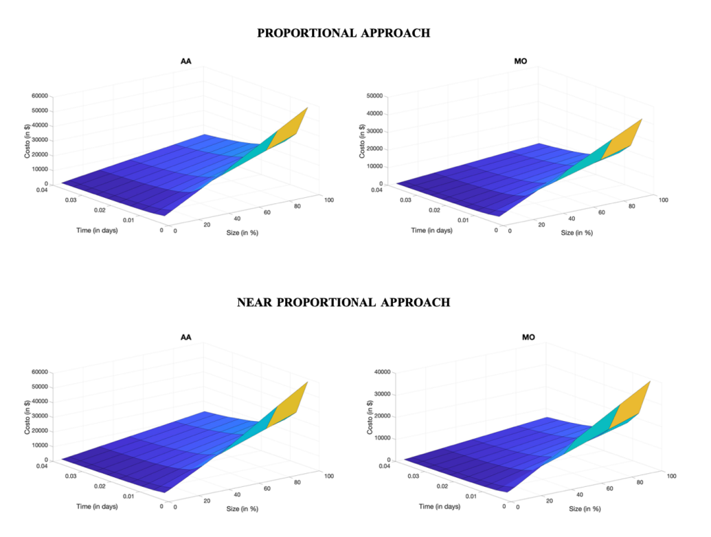

# Liquidity-Price-Impact

This repository contains the main package for **price impact computation** in the case of liquidity distress. The model is specifically optimized for **Iccrea Banking Group** and has been developed by **Luca Persia** (Politecnico di Milano), **Michele Bonollo** (Politecnico di Milano), and **Simone Frigerio** (Iccrea Banking Group). 

## Overview

This model focuses on **liquidity risk management** and **price impact estimation** for asset portfolios in liquidity distress scenarios. It calculates the cost of liquidation under different stress levels and time horizons, supporting asset managers in evaluating potential liquidity risks.

### Key Features:
- **Price Impact Computation**: The model computes the impact of liquidating financial positions under various stress levels (5%, 10%, 30%, 50%, 80%, and 100%).
- **Liquidity Surface Generation**: It generates liquidity surfaces to visualize the cost of liquidation over time and market conditions.
- **Stress Test Scenarios**: Includes different stress test scenarios for proportional and near-proportional liquidation strategies.

## Model Details

The model relies on **MATLAB** functions for price impact computation and uses market data to calibrate parameters such as **market depth**, **market elasticity**, and **market impact**. It is based on theoretical models such as the **Zarinelli et al. (2014)** and **Gatheral (2010)** frameworks for liquidity surface generation.

The model is structured to handle different liquidation strategies and simulate potential liquidity risks for various portfolios.

## Optimized for Iccrea

**Important:** This model is specifically **optimized for the internal systems** of **Iccrea Banking Group**. It requires integration with proprietary data sources, making it **non-executable outside of Iccrea’s ecosystem**.

- **Data Privacy**: The model operates on sensitive financial data that is **not publicly available** due to privacy and confidentiality constraints.
- **Internal Use**: Execution of the model requires access to Iccrea's internal data management systems. Attempting to run this model outside Iccrea will likely result in errors due to missing data and integration dependencies.

## Folder Structure

The repository includes an `src` folder containing all the MATLAB functions related to the price impact model.

```bash
.
├── code/                    # Core MATLAB functions for price impact calculation
│   ├── impact_price/        # Functions for calculating impact prices
│   ├── charts/              # Scripts for visualizations
│   ├── metaorders/          # Functions for metaorders simulations
│   ├── utils/               # Utility functions
│   └── main/                # Main script to run the model
├── docs/
│   │   └── liquidity_surface_MSCI.png
│   │   └── liquidity_surface_NP.png
│   │   └── LucaPersia_QF_Master_Thesis.pdf
├── README.md               # This file
```

## Model Outputs

The model produces several outputs, including:

- **Impact Price Surfaces**: 3D surfaces that show the cost of liquidation as a function of time and stress level.
  
- **Calibrated Parameters**: These parameters are tailored to Iccrea’s portfolio data for accurate liquidity risk assessment.
- **Stress Test Reports**: Reports generated for different liquidation strategies, showing the cost implications and risk assessments.


## How to Run the Model

### Prerequisites:
- **MATLAB** (R2020b or newer)
- Access to Iccrea’s internal data management system

### Running the Model:
To run the model, ensure that the required data is available and correctly formatted according to Iccrea's internal system. Without access to proprietary data, the model will not function properly.

1. Clone the repository:

   ```bash
   git clone https://github.com/iccrea/Liquidity-Price-Impact.git
   ```

2. Open MATLAB and navigate to the `code` folder:

   ```matlab
   cd src
   ```
   
3. Run the `main.m` script to execute the model.
   
## Model Inputs:
The model requires the following inputs:

- Market data (e.g., price, volume, bid-ask spread)
- Portfolio data (list of securities and asset allocations)
- All inputs must be sourced from Iccrea’s internal data systems.

## Outputs:
- Liquidity Surfaces: Visual representations of liquidation costs over time.
  
- Stress Test Results: Numerical and graphical reports showing the liquidation costs under various scenarios.

## Model Limitations
The model is highly optimized for Iccrea's specific needs and systems but has some limitations:

- Proprietary Data: This model cannot be executed outside Iccrea without proper access to its data systems.
- Calibration: The model’s calibration is portfolio-specific. Running the model on different portfolios may require recalibration of parameters.
- Simulation Noise: Simulated metaorders for equity portfolios tend to have more noise compared to bond portfolios.

## License
This project is licensed under Iccrea’s Internal Use Only policy. Redistribution or external use of this model is prohibited unless explicitly authorized by Iccrea Banking Group’s risk management team.
